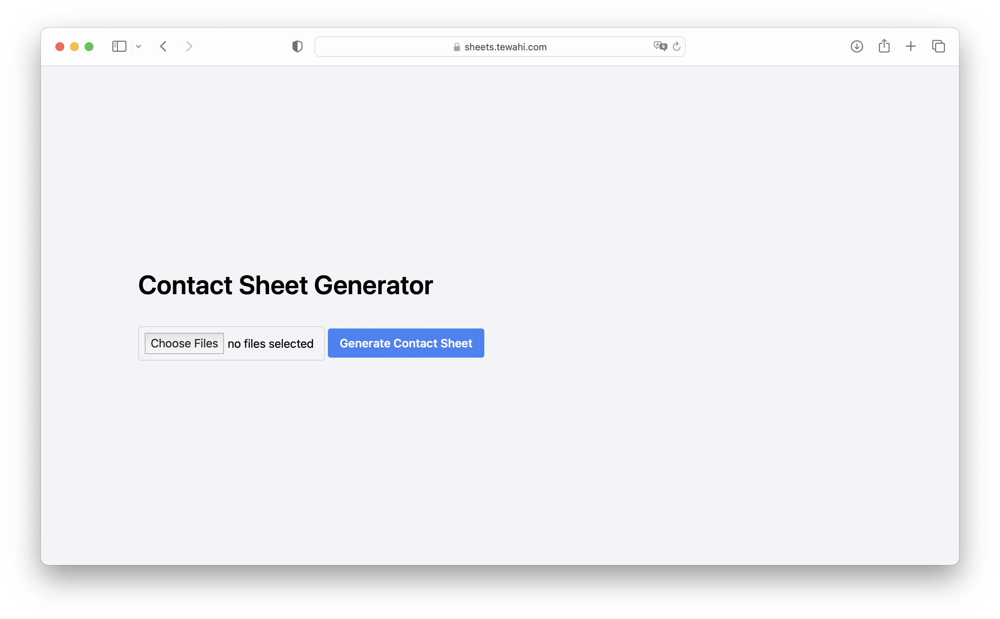

# sheet

A simple client-side web app that allows users to upload multiple images and generate contact sheets in a JPEG format. The contact sheets are created with a portrait layout (similar to A4 or letter paper size), and each sheet can accommodate up to 15 images (3 columns x 5 rows).

## Features

- Upload multiple images (JPEG, PNG, etc.)
- Automatically adjust image orientation based on EXIF data
- Maintain original aspect ratio of images without stretching
- Add padding between images
- Generate multiple contact sheets if the number of images exceeds the capacity of a single sheet
- Display a loading message while generating contact sheets

## Usage

1. Open the app in your web browser.
2. Click on the "Choose Files" button or drag and drop your images onto the input area.
3. Click the "Generate Contact Sheet" button to create and download the contact sheet(s) in JPEG format.

## Technologies Used

- HTML5
- JavaScript
- [Tailwind CSS](https://tailwindcss.com/)
- [Exif.js](https://github.com/exif-js/exif-js) library for reading EXIF data

## License

This project is licensed under the [MIT License](https://choosealicense.com/licenses/mit/).
